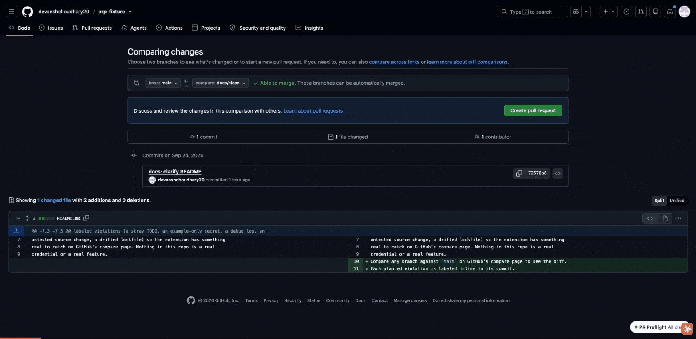
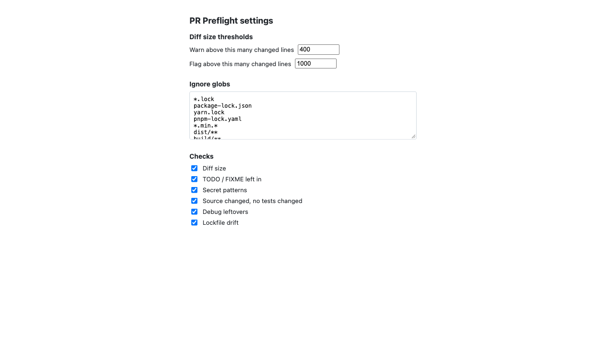

# PR Preflight

A self-review checklist for GitHub's compare page. Six diff checks run the moment you land on `/compare` or `/pull/new`, before anyone else has seen the PR, no API key and no setup.



## The six checks

| # | Check | Fires when |
|---|---|---|
| 1 | Diff size | Changed lines/files cross a warn or flag threshold (defaults: warn 400 lines / 20 files, flag 1000 lines / 50 files) |
| 2 | TODO / FIXME left in | An added line matches `TODO`, `FIXME`, `XXX`, or `HACK` |
| 3 | Secret patterns | An added line matches a known key/token/private-key shape, or a changed file is named `.env`/`.env.*` |
| 4 | Source changed, no tests changed | Source files changed but no matching test file did |
| 5 | Debug leftovers | An added line has `console.log`/`debugger`/`binding.pry`/`byebug`/`dd()`/`var_dump`/a bare `print(` in Python |
| 6 | Lockfile drift | A manifest (`package.json`, `pyproject.toml`, etc.) changed its dependencies but the paired lockfile didn't |

Findings never block "Create pull request." This informs, it doesn't gate.

## Install from the store

Chrome Web Store listing (pending review): https://chromewebstore.google.com/detail/khgpmbkndlkngcldfafgkkjgaabconfp

[Chrome Web Store listing — link pending review]

## Install from a zip (while the store review is in progress)

1. Download `pr-preflight-<version>.zip` from [Releases], or build it yourself (see Development below).
2. Unzip it, or use `dist/` directly if building from source.
3. Open `chrome://extensions`.
4. Enable **Developer mode** (top-right toggle).
5. Click **Load unpacked**, and pick the unzipped folder (or `dist/`).

[Releases]: https://github.com/devanshchoudhary20/pr-preflight/releases

## Development

```bash
npm install
npm run dev       # vite dev server, watches for changes
npm test          # vitest, runs the pure runChecks() suite against fixture diffs
npm run build     # tsc --noEmit && vite build → dist/
npm run package   # build, then zip dist/ into release/pr-preflight-<version>.zip
```

Load `dist/` via `chrome://extensions` → Developer mode → Load unpacked during development, same as the install-from-zip path above.

The options page (defaults shown below) sets the warn/flag thresholds and toggles per-check: 

## Privacy

No data leaves `github.com`. See [PRIVACY.md](./PRIVACY.md).

## License

MIT

## Later

- BYOK Claude summary (opt-in, 3-bullet risk summary). Deferred from v1 on purpose: adds `host_permissions` for `api.anthropic.com`, a privacy policy requirement, and a longer store review. Candidate for v1.1 after the listing is live.
- GitHub Enterprise custom domains via `optional_host_permissions`.
- GitLab merge request creation page.
- Repo-level config `.prpreflight.json` for team thresholds.
- Extra checks: large binaries added, `.only(` in tests, merge-conflict markers, commented-out code blocks.
- Firefox port.
